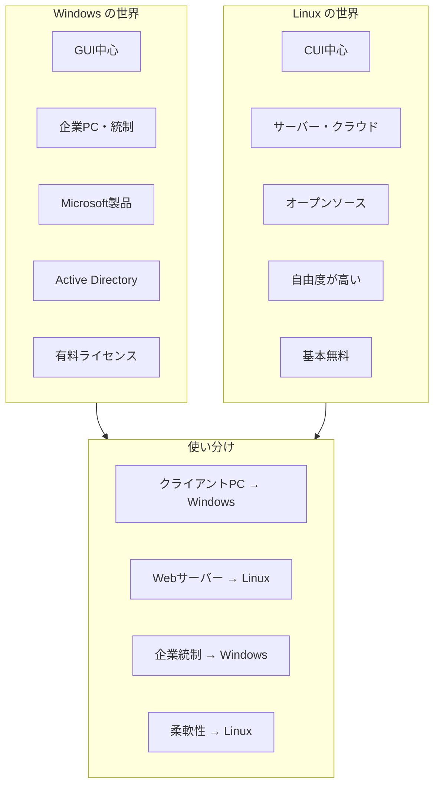
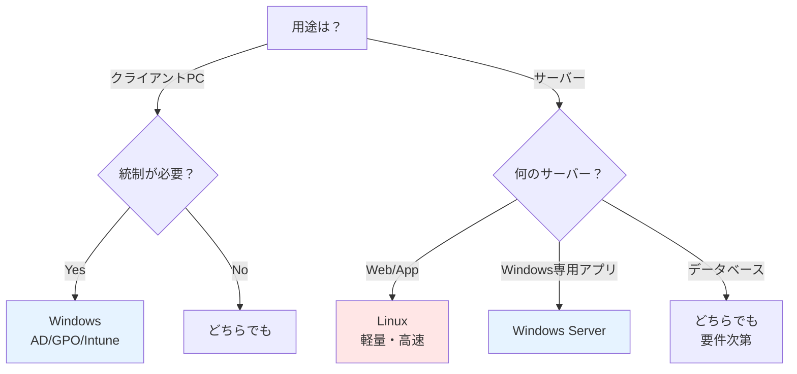

# Windows vs Linux 初心者向け比較ガイド

## 🎯 結論（3行で）

- **Windows**: GUIで直感的。企業のPC・統制に強い。Microsoftエコシステム
- **Linux**: CUI中心。サーバー・クラウドに強い。自由度が高い
- **使い分け**: クライアントPCはWindows、サーバーはLinuxが多い

---

## 📊 全体像（一目で理解）



---

## 🆚 基本的な違い

| 項目 | Windows | Linux |
|-----|---------|-------|
| **開発元** | Microsoft | コミュニティ（多数） |
| **ライセンス** | 有料（商用） | 無料（OSS） |
| **操作** | GUI中心 | CUI中心（GUIもある） |
| **主な用途** | クライアントPC、企業統制 | サーバー、クラウド |
| **シェア（PC）** | 約70% | 約3% |
| **シェア（サーバー）** | 約30% | 約70% |
| **カスタマイズ** | 限定的 | 自由度が高い |
| **統制機能** | AD/GPO（強力） | 個別設定 |

---

## 💭 思想の違い

### Windows

```yaml
思想:
  「統一されたエクスペリエンス」
  
特徴:
  ✅ 一貫したGUI
  ✅ 企業統制の仕組みが組み込み
  ✅ Microsoft製品との統合
  ✅ サポートが手厚い

向いている人:
  - GUI操作が好き
  - Microsoft製品を使う
  - 企業のIT管理者
```

---

### Linux

```yaml
思想:
  「自由・柔軟性・透明性」
  
特徴:
  ✅ オープンソース
  ✅ カスタマイズ自由
  ✅ 軽量・高速
  ✅ コマンド操作が強力

向いている人:
  - 技術的な自由度を求める
  - サーバー構築・運用
  - コマンド操作が好き
```

---

## 🖥️ 画面・操作の違い

### Windows

```
デスクトップ
├─ スタートメニュー（GUI）
├─ エクスプローラー（ファイル管理）
├─ コントロールパネル（設定）
└─ PowerShell（コマンド）

操作:
  マウスクリック中心
  設定は GUI で完結
```

---

### Linux

```
ターミナル（CUI）中心
├─ シェル（bash/zsh等）
├─ コマンド操作
├─ テキストエディタ（vim/nano）
└─ パッケージマネージャー（apt/yum）

操作:
  キーボード・コマンド中心
  設定ファイルを直接編集
```

---

## 📁 ファイルシステムの違い

### Windows

```yaml
ドライブ文字:
  C:\（システム）
  D:\（データ）
  
パス表記:
  C:\Users\user\Documents
  バックスラッシュ (\)

ファイル名:
  大文字小文字を区別しない
  test.txt = TEST.TXT
```

---

### Linux

```yaml
ルートから始まる:
  / （ルート）
  
パス表記:
  /home/user/documents
  スラッシュ (/)

ファイル名:
  大文字小文字を区別する
  test.txt ≠ TEST.TXT
```

---

## ⚙️ コマンドの違い

| 操作 | Windows | Linux |
|-----|---------|-------|
| **ディレクトリ一覧** | `dir` | `ls` |
| **ディレクトリ移動** | `cd` | `cd` |
| **ファイルコピー** | `copy` | `cp` |
| **ファイル移動** | `move` | `mv` |
| **ファイル削除** | `del` | `rm` |
| **テキスト表示** | `type` | `cat` |
| **ネットワーク確認** | `ipconfig` | `ifconfig` / `ip a` |
| **プロセス一覧** | `tasklist` | `ps` |
| **プロセス停止** | `taskkill` | `kill` |

---

## 🔧 ソフトウェアインストールの違い

### Windows

```yaml
方法:
  1. exe ファイルをダウンロード
  2. インストーラーを実行
  3. GUI で次へ次へ

パッケージマネージャー:
  Chocolatey（サードパーティ）
  winget（標準）
```

---

### Linux

```yaml
方法:
  パッケージマネージャーでインストール

例（Ubuntu/Debian）:
  sudo apt update
  sudo apt install nginx

例（CentOS/RedHat）:
  sudo yum install nginx
```

---

## 🌐 サーバー用途での違い

### Webサーバーを立てる場合

#### Windows

```powershell
# IIS（Internet Information Services）を使用
# GUI で設定

# または
# PowerShellでインストール
Install-WindowsFeature -Name Web-Server

# 設定はGUI中心
```

---

#### Linux

```bash
# Nginx を使用
# コマンドでインストール

sudo apt update
sudo apt install nginx

# 設定ファイルを編集
sudo nano /etc/nginx/nginx.conf

# サービス起動
sudo systemctl start nginx
```

---

## 💼 企業での使い分け



---

## 🏢 実務での典型例

### 例1: スタートアップ企業

```yaml
クライアントPC:
  Mac または Windows（個人の自由）

サーバー:
  Linux（AWS EC2/Azure VM）
  
理由:
  - コスト削減（Linuxライセンス無料）
  - クラウド・コンテナと相性良い
```

---

### 例2: 大企業

```yaml
クライアントPC:
  Windows（統制必須）
  → Active Directory / GPO / Intune

サーバー:
  - Webサーバー: Linux
  - 業務アプリサーバー: Windows Server
  - データベース: 要件次第

理由:
  - 企業統制が必要
  - 既存のMicrosoft資産
```

---

## 📚 学習の違い

### Windowsを学ぶ

```yaml
学ぶこと:
  ✅ GUI操作
  ✅ Active Directory（企業向け）
  ✅ PowerShell（自動化）
  ✅ グループポリシー（統制）

難易度: ⭐⭐（GUIで直感的）

学習リソース:
  - Microsoft公式ドキュメント
  - 企業研修
```

---

### Linuxを学ぶ

```yaml
学ぶこと:
  ✅ コマンド操作（基本）
  ✅ シェルスクリプト
  ✅ ファイル権限（chmod/chown）
  ✅ プロセス管理
  ✅ サービス管理（systemctl）

難易度: ⭐⭐⭐（コマンド習得が必要）

学習リソース:
  - Linux標準教科書
  - Udemy等のオンライン講座
```

---

## 🔐 セキュリティの違い

### Windows

```yaml
特徴:
  ✅ Windows Defenderが標準
  ✅ Windows Updateで自動更新
  ✅ ユーザーアカウント制御（UAC）

弱点:
  ❌ ウイルス・マルウェアの標的になりやすい
  ❌ 再起動が頻繁

運用:
  WSUS / Intune / Autopatch で管理
```

---

### Linux

```yaml
特徴:
  ✅ 権限管理が厳格（root/sudo）
  ✅ パッケージマネージャーで更新
  ✅ ウイルスが少ない

弱点:
  ❌ 設定ミスでセキュリティホール
  ❌ 手動更新が必要な場合も

運用:
  yum-cron / unattended-upgrades で自動化
```

---

## 💰 コストの違い

### Windows

```yaml
ライセンス費用:
  Windows 10/11 Pro: 約3万円
  Windows Server: 約10万円〜

クラウド:
  AWS: Windows EC2 は Linux の約2倍
  Azure: Azure Hybrid Benefit で節約可能

追加コスト:
  Office 365 / Microsoft 365
```

---

### Linux

```yaml
ライセンス費用:
  無料（OSS）

クラウド:
  AWS/Azure: Linux EC2/VM はコスト安

有償サポート（企業向け）:
  - Red Hat Enterprise Linux（RHEL）
  - Ubuntu Pro
```

---

## 🚀 クラウドでの使い分け

### AWS/Azureでの選択

```yaml
Linux を選ぶケース:
  ✅ Webサーバー（Nginx/Apache）
  ✅ コンテナ（Docker/Kubernetes）
  ✅ コスト重視
  ✅ スクリプト自動化

Windows を選ぶケース:
  ✅ .NET アプリケーション
  ✅ SQL Server
  ✅ Active Directory統合
  ✅ 既存Windows資産の移行
```

---

## 🎓 初心者が最初に学ぶべきこと

### Windowsユーザー

```yaml
まず覚えること:
  1. PowerShell基本（コマンド操作）
  2. Active Directory（企業向け）
  3. イベントビューアー（ログ確認）

次のステップ:
  - GPO設計
  - WSUS/Autopatch
  - Azure/M365統合
```

---

### Linuxユーザー

```yaml
まず覚えること:
  1. 基本コマンド（ls/cd/cp/mv/rm）
  2. ファイル権限（chmod/chown）
  3. vi/nano（テキスト編集）

次のステップ:
  - シェルスクリプト
  - systemctl（サービス管理）
  - ネットワーク設定
```

---

## 🔄 両方を使う現実

### 実務では両方必要

```yaml
典型的な構成:

クライアント側:
  Windows PC
  ↓ RDP/SSH
  
サーバー側:
  - Webサーバー: Linux
  - DBサーバー: Linux or Windows
  - ADサーバー: Windows Server

結論:
  どちらか一方ではなく、
  両方を理解する必要がある
```

---

## ❓ よくある質問

### Q1: どちらを先に学ぶべき？

**A:** 用途次第です。

```
クライアントPC・企業IT管理 → Windows
サーバー・クラウド・開発 → Linux

ただし、
最終的には両方必要になる
```

---

### Q2: Linuxは難しい？

**A:** コマンド操作に慣れるまでは難しく感じます。

```
最初の1〜2週間: コマンドが覚えられない
1ヶ月後: 基本操作ができる
3ヶ月後: 自動化スクリプトが書ける

継続すれば必ず慣れる
```

---

### Q3: 企業PCでLinuxは使える？

**A:** 技術的には可能だが、現実的には困難。

```
問題点:
  ❌ Active Directory統合が弱い
  ❌ Officeの互換性
  ❌ 社内システムがWindows前提
  ❌ IT部門のサポート対象外

例外:
  開発部門で一部導入
  または Mac
```

---

## 💡 まとめ（暗記すべき結論）

### Windows

```
得意分野:
  - クライアントPC
  - 企業統制（AD/GPO）
  - Microsoft製品統合

選ぶ理由:
  - GUIで直感的
  - 企業の標準
  - サポートが手厚い
```

---

### Linux

```
得意分野:
  - サーバー
  - クラウド
  - コンテナ

選ぶ理由:
  - 無料
  - 軽量・高速
  - 自由度が高い
```

---

### 使い分けの現実

```
✅ クライアントPC: Windows
✅ Webサーバー: Linux
✅ 企業統制: Windows（AD）
✅ コンテナ: Linux
✅ データベース: 要件次第
```

---

## 📚 次に学ぶべきこと

### Windowsを深掘り

- [Windows Server設計](./05-Azure/microsoft-infra-wiki/03_onprem-windows-server-design.md)
- [Active Directory / GPO](./05-Azure/microsoft-infra-wiki/04_hybrid-ad-azure-m365-design.md)

### Linuxを深掘り

- Linux標準教科書
- シェルスクリプト
- AWS/Azureでの実践

---

## 🎯 面談で使える一言

> 「WindowsとLinuxの違いは、思想と用途です。  
> 
> Windowsは統一されたGUI・企業統制に強く、  
> クライアントPCや企業のIT基盤で使われます。  
> 
> Linuxはオープンソースで自由度が高く、  
> サーバー・クラウド・コンテナで圧倒的なシェアです。  
> 
> 実務では、クライアントはWindows、  
> サーバーはLinuxという使い分けが多いです。  
> 両方を理解することが重要です。」

---

**どちらも重要！両方を学びましょう** 🚀
